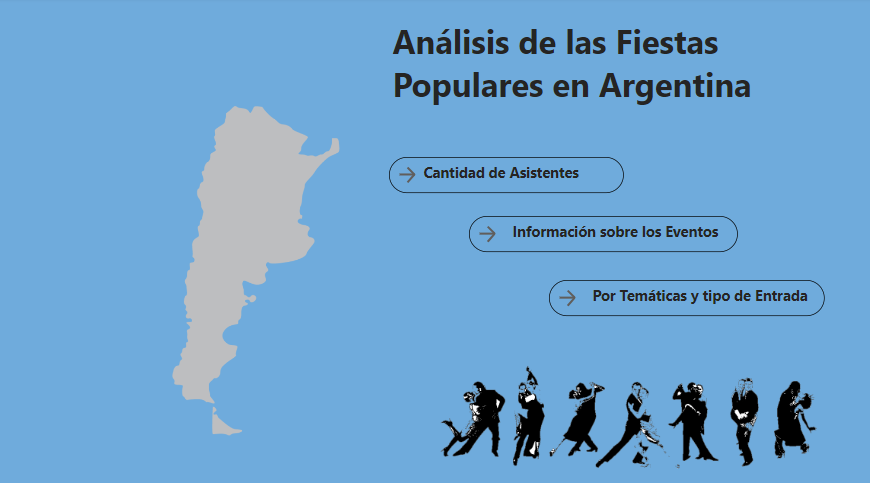
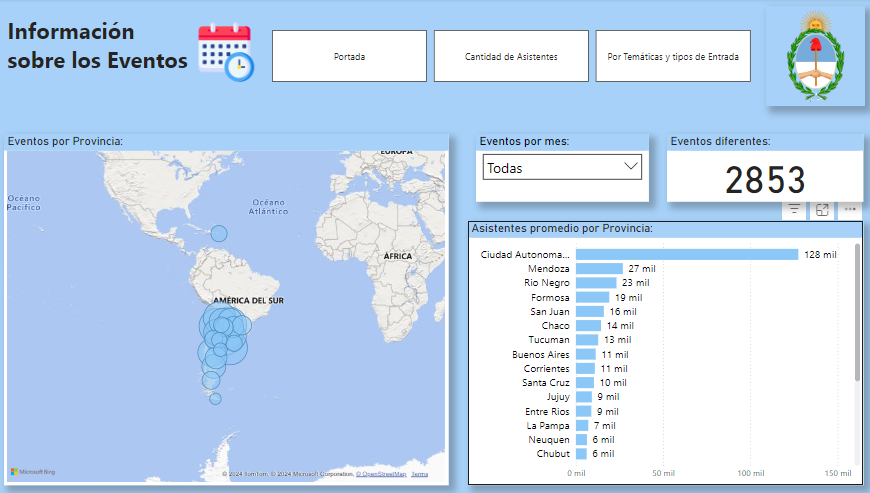

# Fiestas Populares - Power BI Report

Este proyecto de Power BI permite explorar y analizar información sobre eventos y festividades populares en Argentina. Contiene cuatro pestañas de análisis que detallan aspectos importantes como el número de asistentes, la ubicación de los eventos, la información sobre la organización y la temática de cada evento. A continuación, se describe cada pestaña y los gráficos que contiene.

## Contenidos del Dashboard

### 1. Portada:

- Una introducción visual al informe, incluyendo el título, una descripción general, y un resumen de los contenidos.

### 2. Asistentes:

En esta pestaña se analiza la cantidad de asistentes a los eventos en diferentes períodos y tipos de entradas.
- **Asistentes por Mes**: Gráfico de segmentación de datos que permite filtrar el número de asistentes por mes.
- **Asistentes por Año**: Gráfico de barras que muestra la cantidad de asistentes por año.
- **Asistentes por Tipo de Entrada**: Gráfico de torta que clasifica a los asistentes según el tipo de entrada (gratuita, paga, etc.).

#### Indicadores Clave de Desempeño (KPIs):
- **Asistencia Total a Eventos**: KPI que muestra el número total de asistentes.
- **Asistencia Promedio**: KPI que muestra el promedio de asistencia a eventos.
  

### 3. Información:

Esta pestaña profundiza en los detalles de los eventos, como la ubicación y los tipos de eventos organizados en diferentes provincias.
- **Eventos por Provincia**: Mapa que muestra la distribución de eventos en las distintas provincias.
- **Eventos Diferentes**: KPI que destaca el número de eventos únicos.
- **Filtro de Provincia**: Permite seleccionar una provincia específica para analizar los datos correspondientes.
- **Asistentes Promedio por Provincia**: Gráfico que muestra el promedio de asistentes en cada provincia.

### 4. Temática
Aquí se examina la temática de los eventos, proporcionando detalles sobre el tipo de entrada y los temas populares.
- **Temática**: Segmentación de datos que permite seleccionar eventos según su temática principal.
- **Eventos por Tipo de Entrada**: Gráfico de torta que clasifica los eventos según el tipo de entrada.
- **Eventos por Temática**: Gráfico de barras que muestra la cantidad de eventos según su temática principal.

#### KPIs:
- **Evento Más Popular**: KPI que muestra el evento más popular.
- **Eventos Religiosos/Culto**: KPI que muestra la cantidad de eventos religiosos o de culto.
- 

